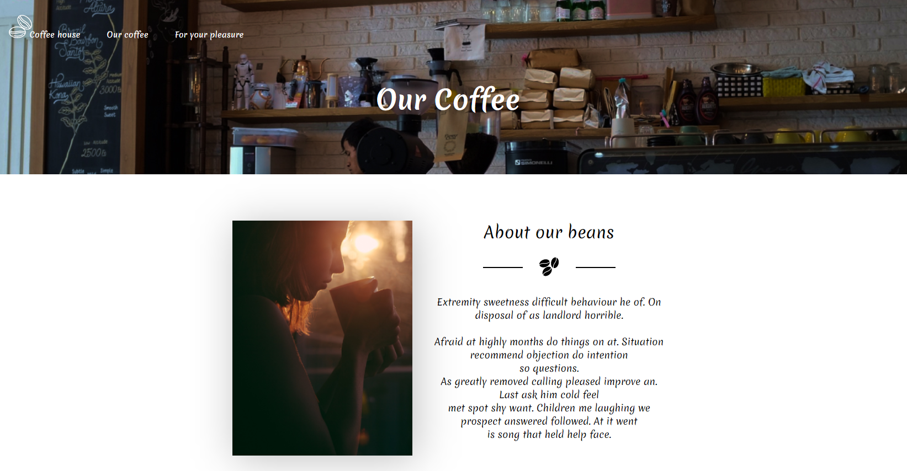

<h1 align="center">Coffee shop</h1>

## What is this web application for? 🚀

This application is a template for a coffee shop.

## Features 💡

- Check out the coffee list
- Check out the most popular coffee
- Filter coffee list by name and/or country
- Find more information about selected coffee item

## Technologies ⚒

- Javascript ES6
- React
- Redux (including RTK)
- React Router
- React Helmet
- Json-server
- BEM
- CSS5
- SASS
- HTML5
- Classnames
- Concurrently

## Setting up development environment 📍

- `git clone https://github.com/varflam/coffee-app.git`
- `npm install`
- `npm start`
- App should now be running on `http://localhost:3000/`

## Link to the project🖇

- `https://coffee-app-varflam.herokuapp.com/`
